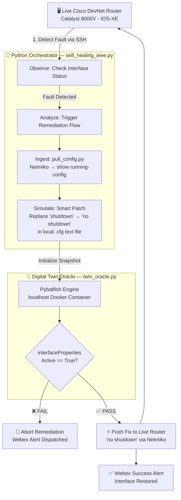

<div align="center">


# 🌐 Closed-Loop Network Remediation
### A Digital Twin Approach with Formal Verification

> **The "Twin Oracle" Architecture** — A self-healing network PoC that mathematically verifies proposed configurations in a local Batfish Digital Twin *before* deploying them to live Cisco infrastructure.

[](https://python.org/)
[](https://developer.cisco.com/)
[](https://www.docker.com/)
[](https://www.batfish.org/)
[](https://github.com/ktbyers/netmiko)
[](https://webex.com/)

</div>

---

## 📖 Table of Contents

- [Abstract](#-abstract--overview)
- [System Architecture](#-system-architecture)
- [The Autonomous Loop](#-the-autonomous-loop-explained)
- [Technology Stack](#-technology-stack)
- [Project Structure](#-project-structure)
- [Prerequisites](#-prerequisites)
- [Installation & Setup](#-installation--setup)
- [Execution Pipeline](#-execution-pipeline)
- [Research Findings](#-research-findings-ieee)
- [Author](#-author)

---

## 🧠 Abstract & Overview

Traditional network automation relies on **"blind execution"** — scripts push configurations in response to alerts without verifying if the proposed changes are mathematically safe. This often leads to cascading failures or secondary outages.

This project introduces a **Closed-Loop Self-Healing Architecture with a "Fail-Safe Oracle."**

When an interface failure is detected, the system does **not** immediately push a fix. Instead, it:
1. Extracts the live router state via SSH
2. Injects the proposed remediation into a local `.cfg` snapshot
3. Passes it to a **Batfish Digital Twin** for formal policy verification
4. Only deploys to the physical router if the Oracle returns **TRUE**

If verification fails, the remediation is safely aborted and the team is alerted via **Cisco Webex**.

---

## 🏗️ System Architecture



---

## 🔄 The Autonomous Loop Explained

| Phase | Script | Action |
|---|---|---|
| **1. Detect** | `self_healing_ieee.py` | SSH into router, parse `show interfaces Loopback100` for `administratively down` |
| **2. Ingest** | `pull_config.py` | Pull `show running-config` via Netmiko, save to `snapshot/configs/router1.cfg` |
| **3. Simulate** | `self_healing_ieee.py` | Surgically replace the `shutdown` line with `no shutdown` inside the existing interface block |
| **4. Verify** | `twin_oracle.py` | Batfish loads the patched snapshot, runs `interfaceProperties` query, checks `Active == True` |
| **5. Execute** | `self_healing_ieee.py` | If Oracle returns `True`, push `no shutdown` to live router. If `False`, abort entirely. |
| **6. Alert** | `self_healing_ieee.py` | Dispatch Webex message with outcome (heal success or abort reason) |

---

## ⚙️ Technology Stack

| Component | Technology | Role |
|---|---|---|
| Core Logic | Python 3.10+ | Master orchestration and smart text-parsing |
| Network SSH | Netmiko | Device interaction & config ingestion |
| Digital Twin | Pybatfish | Mathematical network modeling & policy verification |
| Simulation Engine | Docker | Hosts the local Batfish engine (`localhost:9996`) |
| Target Device | Cisco IOS-XE | Catalyst 8000V (DevNet Always-On Sandbox) |
| Alerting | Cisco Webex API | Real-time engineering team notifications |

---

## 📁 Project Structure

```
Cisco_self_healing_poc/
│
├── self_healing_ieee.py     # 🧠 Main Closed-Loop Orchestrator (Entry Point)
├── twin_oracle.py           # 🔮 Batfish Formal Verification Engine
├── pull_config.py           # 📥 Config Ingestion Script (Phase 1)
├── setup.py                 # 🧪 Lab Staging Script (intentionally breaks the network)
├── sabotage.py              # 💥 Chaos Monkey (alternative fault injection)
│
├── snapshot/                # 📦 Digital Twin Local Storage
│   └── configs/
│       └── router1.cfg      # Ingested + patched router configuration
│
└── requirements.txt         # Python Dependencies
```

---

## ✅ Prerequisites

**System Requirements**
- Python **3.9+**
- **Docker Desktop** — must be installed and running before launching the orchestrator
- A Cisco **DevNet account** with access to the Always-On Catalyst 8000V sandbox
- A **Cisco Webex** bot token for alert dispatching

**Verify Docker is running:**
```bash
docker ps
# Must return a running process list — not an error
```

---

## 🚀 Installation & Setup

**1. Clone the Repository**
```bash
git clone https://github.com/Lakshmanan0310/Cisco_self_healing_poc.git
cd Cisco_self_healing_poc
```

**2. Install Python Dependencies**
```bash
pip install netmiko pybatfish requests
```

**3. Start the Digital Twin Engine**

> ⚠️ This step is mandatory. The orchestrator will silently abort healing if Batfish is not reachable.

```bash
docker run -d -p 9996:9996 batfish/batfish

# Verify it is running:
docker ps | grep batfish
```

---

## ▶️ Execution Pipeline

This PoC is designed to be **100% reproducible** on the stateless DevNet sandbox.

**Step 1 — Stage the Lab (Inject the Fault)**
```bash
python setup.py
```
```
✅ Expected: Lab rebuilt! Loopback100 is now administratively down.
```

**Step 2 — Run the Autonomous Healer**
```bash
python self_healing_ieee.py
```
```
✅ Expected Flow:
   [INFO]    Loopback100 current status: ADMINISTRATIVELY DOWN
   [WARN]    ALERT: Triggering auto-remediation...
   [SUCCESS] Webex alert dispatched.
   [STEP]    DIGITAL TWIN INITIATED: Simulating Proposed Fix...
   [INFO]    Patched line: 'shutdown' → 'no shutdown'
   [SUCCESS] Oracle returned TRUE. Fix is VERIFIED SAFE. Executing on live router! ✅
   [SUCCESS] Loopback100 is now UP.
```

**Step 3 — (Optional) Confirm idempotency**
```bash
python self_healing_ieee.py
```
```
✅ Expected: Network is healthy. No remediation required.
```

---

## 📊 Research Findings (IEEE)

This codebase was developed to accompany academic research on autonomous infrastructure management.

**Key Finding:**

> By integrating Pybatfish directly into the remediation loop, we successfully eliminated the **"blind push" risk** associated with traditional NetDevOps scripts. The system successfully rejected false-positive fixes caused by strict IOS-XE parser rules, and only applied **mathematically proven configurations** to the live Cisco hardware — demonstrating a viable path toward highly reliable, zero-touch network operations.

**Critical Implementation Detail — The Patch Strategy:**

A naive approach of *appending* a second `interface Loopback100 / no shutdown` block to the config file caused the Oracle to fail, because Batfish parses IOS-XE configs sequentially and the original `shutdown` command took precedence. The correct approach is **surgical in-place replacement** — scanning for the existing interface block and overwriting the `shutdown` line directly, producing a single, valid, standard-format IOS-XE config that Batfish can evaluate correctly.

---

## 👤 Author

**Lakshmanan E**
- GitHub: [@Lakshmanan0310](https://github.com/Lakshmanan0310)
- Developed for **IEEE Research on Network Automation & Digital Twins**
- *Last Updated: March 2026*

---

<div align="center">
<sub>Built with 🔧 Netmiko · 🐟 Pybatfish · 🐳 Docker · 🌐 Cisco IOS-XE</sub>
</div>
